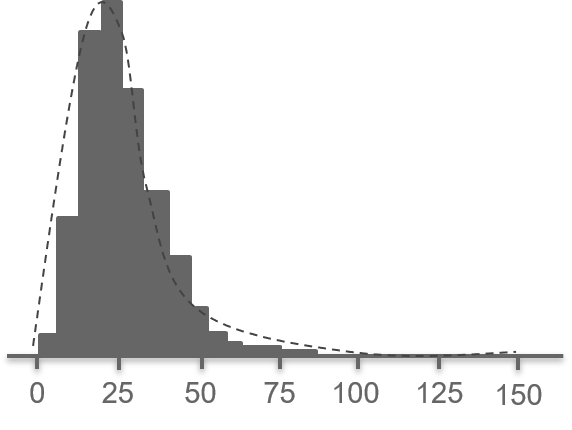

# AI CUP 2019 - 人工智慧論文機器閱讀競賽之論文標註

Please classify the multi-labels of each sentence in the paper. 

Multi-labels (**ground truth**) are separated by **space**, and each label is separated by **/**.

論文摘要的句子分類，每個句子的分類以 **空格** 分開，同個句子的多個分類以 **/** 分開。

## Table of Contents

* [AI CUP 2019 - 人工智慧論文機器閱讀競賽之論文標註](#ai-cup-2019---人工智慧論文機器閱讀競賽之論文標註)
  * [Table of Contents](#table-of-contents)
  * [Data Description](#data-description)
  * [Models](#models)
* [Report](#report)
  * [Prologue](#prologue)
  * [Early Start](#early-start)
    * [Data Pre-processing](#data-pre-processing)
    * [Text Pre-processing](#text-pre-processing)
    * [Data Packing](#data-packing)
    * [Build RNNs](#build-rnns)
    * [Training and Predicting](#training-and-predicting)
    * [Current Results](#current-results)
    * [Next Step](#next-step)
  * [BERT-Stage](#bert-stage)
    * [huggingface/transformers](#huggingfacetransformers)
    * [ThilinaRajapakse/simpletransformers](#thilinarajapaksesimpletransformers)
    * [kaushaltrivedi/fast-bert](#kaushaltrivedifast-bert)
    * [google-research/bert](#google-researchbert)
      * [Method 1 - 建立二元分類器](#method-1---建立二元分類器)
      * [Method 2 - 32 種類別分類器](#method-2---32-種類別分類器)
      * [Main Program](#main-program)
  * [ULMFit](#ulmfit)
  * [First Presentation](#first-presentation)
  * [Improvement](#improvement)
    * [Data Analysis](#data-analysis)
    * [Improve RNN Structure](#improve-rnn-structure)
    * [Handle Data Imbalance](#handle-data-imbalance)
    * [Improve Padding Size](#improve-padding-size)
    * [Change Optimizer](#change-optimizer)
    * [Improve Threshold](#improve-threshold)
    * [Fine-Tuning](#fine-tuning)
  * [Other Attempts](#other-attempts)
    * [BERT optimization](#bert-optimization)
    * [Attempts on Data](#attempts-on-data)
      * [Data Augmentation](#data-augmentation)
      * [Embeddings](#embeddings)
        * [Fasttext](#fasttext)
        * [ELMO](#elmo)
      * [Label Encoding](#label-encoding)
    * [Attempts on RNN](#attempts-on-rnn)
      * [Add Attention Layer](#add-attention-layer)
      * [Deeper Networks](#deeper-networks)
      * [Larger Batch Size](#larger-batch-size)
    * [Attempts on Results](#attempts-on-results)
      * [Handle Blank Prediction](#handle-blank-prediction)
      * [Handle Others Prediction](#handle-others-prediction)
      * [Testset Re-train](#testset-re-train)
  * [Summary](#summary)
    * [統整所有結果](#統整所有結果)
    * [額外應用](#額外應用)
    * [心得](#心得)

## Data Description

| Column (Feature) | Description                                                                                       |
| ---------------- | ------------------------------------------------------------------------------------------------- |
| Id               | Serial number. 流水編號，無特別意義。                                                             |
| Title            | Title of the paper. 論文文章標題。                                                                |
| Abstract         | Abstract of the paper. Each sentence is separated by **\$$$**. 論文摘要，以 **\$$$** 將句子隔開。 |
| Authors          | Authors of the paper. Each name is separated by **/**. 論文作者，每個作者以 **/** 將句子分開。    |
| Categories       | Each field is separated by **/**. 該論文在arXiv上的分類，多個分類以 **/** 做分割。                |
| Created Date     | The upload time of paper to www.arxiv.com. 論文上傳至 www.arxiv.com 的日期。                      |

> **[Notice]** Authors, Categories, Created Date的資料可能不完全。

## Models

| Model                                 | Link                                         |
| ------------------------------------- | -------------------------------------------- |
| Baseline RNN + GloVe + Tuning         | [Link](model/rnn_glove.ipynb)                |
| Baseline RNN + GloVe + Label Encoding | [Link](model/rnn_glove_label_encoding.ipynb) |
| Baseline RNN + GloVe + Test Reuse     | [Link](model/rnn_glove_test_reuse.ipynb)     |
| Baseline RNN + FastText               | [Link](model/rnn_fasttext.ipynb)             |
| BERT-0                                | [Link](model/bert-0.ipynb)                   |
| BERT-1                                | [Link](model/bert-1.ipynb)                   |
| BERT-2                                | [Link](model/bert-2.ipynb)                   |
| Usage                                 | [Link](model/usage.ipynb)                    |

# Report

## Prologue

本次參加 AI CUP 所舉辦的「人工智慧論文機器閱讀競賽之論文標註」，是我們團隊的所有人都第一次碰到的 NLP 相關任務。

我們在短時間內閱讀大量 NLP 與 Deep Learning 的相關知識，從基本的 tokenizer, GRU, LSTM, BRNN 觀念，到途中的 Word Embeddings, Word2Vec, GloVe 等處理，最後進階至 ELMO, Attention, Transformer, BERT 等技巧。

在實作時，也互相分享所學，嘗試了許多 data pre-processing 和 hyperparameters fine-tuning 的作法。

隨著分數的進步，我們團隊在整個十二月投入了大量熱情在這次的比賽中，獲得了第 13 名的結果。

在這份報告中，將會看到我們團隊進步的過程、遭遇的難題、努力研究的成果。

## Early Start

在沒有任何基礎與想法的情況下，想要了解 AI CUP 官方和助教各別提供的 sample code 是不明智的。

我們分別學習了台灣大學李宏毅教授在 Youtube 的相關教學影片，以及史丹佛大學吳恩達教授在 Coursera 的課程。

在課程中我們學習文字的表達方式 (one-hot, embeddings)、單字或字典在訓練前的處理手法 (tokenize, dictionary)、RNN 的各種原理 (forward, backword propogation) 和各種架構 (GRU, LSTM, BRNN, DRNN)，還有各式各樣 sequence models 的應用，最重要的是了解到這次的競賽所處理的是一個 multi-label 的問題。

大量的前置學習過後，我們開始研究手中的兩份 sample code，重點大致列為 5 項處理 :

- Data Pre-processing
- Text Pre-processing (Word tokenize/Build dictionary/Word Embeddings)
- Data Packing
- Build RNNs
- Training and Predicting

### Data Pre-processing

首先要將資料截取出來成為 train/valid/test 三組，在這邊可以實作 stopwords, stemming 等操作。

``` python
dataset = pd.read_csv(dataset_url+'task1_trainset.csv', dtype=str)

# Drop unuse columns
dataset.drop('Title',axis=1,inplace=True)
dataset.drop('Categories',axis=1,inplace=True)
dataset.drop('Created Date',axis=1, inplace=True)
dataset.drop('Authors',axis=1,inplace=True)

# Data Partition
trainset, validset = train_test_split(dataset, test_size=0.1, random_state=2020)
```

### Text Pre-processing

這部分必須精確的將論文摘要的文字從句子中切取出來，建立 token, dictionary 以及 embeddings。

tokenize 可以人工編寫演算法切割文字，也可以用 nltk 或 BERT 所提供的 tokenizer 自動切割。

``` python
# nltk tokenizer
from nltk.tokenize import word_tokenize
nltk.download('punkt')

def sentence_to_indices(sentence, word_dict):
    return [word_dict.get(word,UNK_TOKEN) for word in word_tokenize(sentence)]
```

建立字典時，利用所有論文摘要出現的字，並考慮不認識的文字以及 Padding 區塊來建立。

``` python
words = set()
words |= collect_words(dataset_url+'trainset.csv')
word_dict = {'<pad>':PAD_TOKEN,'<unk>':UNK_TOKEN}
for word in words:
    word_dict[word]=len(word_dict)
```

最後用史丹佛大學提供的 pretrained embeddings 來表達每一個切好的文字。

``` python
max_words = len(word_dict)
embedding_matrix = np.zeros((max_words, embedding_dim))
for word, i in word_dict.items():
    embedding_vector = embeddings_index.get(word)
     if embedding_vector is not None:
         embedding_matrix[i] = embedding_vector
```

### Data Packing

Data Packing 是訓練前最重要的一步，必須要將摘要句子文字，封裝成一致的 batch 大小才能有效訓練。

並且需要保留真實的句子數量，幫助未來預測正確的 label 數量。

為此 sample code 特別繼承了 `torch.utils.data.Dataset` 來封裝 data，並用 `collate_fn` function 來保留真實句子數量。

``` python
01 02 03 04 05          01 02 03 04 05
06 07 08 09             06 07 08 09 00
10 11 12 13 14          10 11 12 13 14

27 66 70                27 66 70 00 00
03 36 60 91 99    ->    03 36 60 91 99
15 04 05 06 77          15 04 05 06 77

27 66 70                27 66 70 00 00
03 91 99                03 91 99 00 00
                        00 00 00 00 00
```

> 例如第三個 batch 的句子數量實際為 2，但因 padding 效果訓練時將會視為 3 句，但預測時預測 2 個 label 即可

### Build RNNs

建立 GRU blocks 組成的 BRNN 和必要的 fully connected layers，再插入 pretrained 的 embeddings 就可以準備進行訓練。

``` python
self.embedding = nn.Embedding(vocabulary_size, self.embedding_size)
self.embedding.weight = torch.nn.Parameter(embedding_matrix)
self.sent_rnn = nn.GRU(self.embedding_size, self.hidden_dim,
                       bidirectional=True, batch_first=True)

...

x = self.embedding(x)
b,s,w,e = x.shape
x = x.view(b,s*w,e)
x, __ = self.sent_rnn(x)
x = x.view(b,s,w,-1)
x = torch.max(x,dim=2)[0]
x = torch.relu(self.l1(x))
x = torch.sigmoid(self.l2(x))
```

### Training and Predicting

再來要選擇合適的 optimizer (Adam, AdamW, RMSprop, Momentum) 處理 propogation 的運算，以及適合的 loss function 來計算與 ground truth 的差距。

一開始我們跟隨 sample code 使用 AdamW 和 BCELoss 來實作。

``` python
model = GloVeNet(len(word_dict))
opt = torch.optim.AdamW(model.parameters(), lr=learning_rate)
criteria = torch.nn.BCELoss()
model.to(device)

for epoch in range(max_epoch):
    _run_epoch(epoch, 'train')
    _run_epoch(epoch, 'valid')
```

### Current Results

在結束大量課程加強，以及 sample code 的學習後，我們上傳結果得到了以下的成績 :

| Methods                  | F1 Score | Ranking | Date           |
| ------------------------ | -------- | ------- | -------------- |
| Pure Sample Code         | 0.63     | 135     | 約 11 月 29 日 |
| Adding Pre-trained GloVe | 0.667    | 85      | 約 12 月 03 日 |

### Next Step

接著我們打算使用從 Data Mining 課堂中聽到的 BERT 及 T5 等技術，妄想著能一步登天。

由於 BERT 預處理 data 模式與 sample code 截然不同，團隊決定分支前進，各別使用不同方法來進行 BERT 的引入。


這樣分支前進看起來雖毫無交集，但團隊間互相分享，彼此間都學到了不少東西。

## BERT-Stage

由於吳恩達教授於 Coursera 的課程中有解釋過 attention 的架構，讓我們在理解 BERT 等新技術時能快速上手。

我們閱讀了著名的 「Attention Is All You Need」 以及 「BERT: Pre-training of Deep Bidirectional Transformers for Language Understanding」 兩篇 Google 所發表的論文，
還有各種網路上有關的文章及教材，慢慢熟悉了 self-attention, transformer, BERT, GPT2 等 NLP 領域最新的技術。

Transformer 是一種不同於傳統 RNN 架構的網路模型，首次出現於 「Attention Is All You Need」 論文中，使用了 Encoder-Decoder (Seq2Seq) 架構加上 self-attention 機制，
不只能實現 Attention 的效果，改善詞與詞之間關係，更能達成平行處理。而 BERT 就是 Google 基於 Transformer Encoder part 所實現的一種訓練模型。

BERT 在任何 NLP 任務的效果及排名都非常的好，
團隊成員們紛紛使用基於 pytorch 所開發的 BERT frameworks 以及 google 在 tensorflow 開源的 BERT framework 來實作，大致上可分為四種方法 :

* huggingface/transformers
* ThilinaRajapakse/simpletransformers
* kaushaltrivedi/fast-bert
* google-research/bert

### huggingface/transformers

這個 framework 沒有 simpletransformers 和 fast-bert 那麼便利，在實作該 framework 時參考了非常多的教學，
且為了將該 framework 和 sample code 中的訓練與評分方法架接起來，需要將預處理部分打掉重做。

在建立模型和 tokenizer 的部分十分簡單，可以選擇各式各樣的模型，甚至連最新的 T5 都能在 pytorch 上使用到 :

``` python
PRETRAINED_MODEL_NAME = 'bert-base-uncased'
tokenizer = BertTokenizer.from_pretrained(PRETRAINED_MODEL_NAME, do_lower_case=True)
model = BertForSequenceClassification.from_pretrained(
    PRETRAINED_MODEL_NAME, num_labels=num_labels)
```

而在資料處理方法要新增 masks 和一些 BERT 專屬的 token :

``` python
def label_to_ids_list(sentence):
    new_sent = "[CLS] " + sentence + " [SEP]"
    ids = [tokenizer.convert_tokens_to_ids(text) for text in tokenizer.tokenize(new_sent)]
    return ids

def generate_masks(input_ids):
    attention_masks = []
    # Create a mask of 1s for each token followed by 0s for padding
    for seq in input_ids:
        seq_mask = [float(i > 0) for i in seq]
        attention_masks.append(seq_mask)
    return attention_masks
```

因為 BERT tokenizer 將文字轉成含有負數的 vectors，所以 loss function 也需要一併改成能夠處理負數的 `BCEWithLogitsLoss`。

``` python
param_optimizer = list(model.named_parameters())
no_decay = ['bias', 'gamma', 'beta']

optimizer_grouped_parameters = [
    {'params': [p for n, p in param_optimizer if not any(nd in n for nd in no_decay)],
        'weight_decay_rate': 0.01},
    {'params': [p for n, p in param_optimizer if any(nd in n for nd in no_decay)],
        'weight_decay_rate': 0.0}
]

# BCELoss can't handle negative values
criteria = torch.nn.BCEWithLogitsLoss()
optimizer = torch.optim.AdamW(optimizer_grouped_parameters, lr=learning_rate)
```

主要的幾次測試結果如下 :

| Attempts | Methods             | F1 Score | Analysis                                                        |
| -------- | ------------------- | -------- | --------------------------------------------------------------- |
| 1        | Default             | 0.635    | 架接到能夠運行時，得到了一個預期之外的分數                      |
| 2        | Label Encoding      | 0.61     | 將 onehot 轉為 labels，想說不同的 loss 和 activation 能有所改善 |
| 3        | Modify Data Packing | 0.65     | 或許是資料處理錯了，所以重新調整了預處理方式，稍微改善          |

原本覺得 BERT 能夠一步登天，但跟預期的差距太大導致產生了非常大的失落感，
所以認為回去改善 GloVe-based 的 RNN 才可能得到更好的成果。

### ThilinaRajapakse/simpletransformers

此套件將所有需要的 BERT 專屬工具都已架構好了，比如說: Tokenizer、Pre-trained model、loss function…，以上都可以由參數來微調。

``` python
from simpletransformers.classification import MultiLabelClassificationModel

model = MultiLabelClassificationModel('bert', 
                                      'bert-base-uncased', 
                                      num_labels=6, 
                                      pos_weight = [1.2577, 0.9933, 1.2028, 1.0771, 0.7957, 0.6734],
                                      args={'train_batch_size':batch_size, 
                                            'eval_batch_size':batch_size, 
                                            'adam_epsilon':adam_epsilon, 
                                            'learning_rate':learning_rate, 
                                            'max_seq_length':max_seq_length,
                                            'num_train_epochs':num_train_epochs, 
                                            'overwrite_output_dir': True})
```

- **threshold** : 預設為 0.5，predict 時會用到的，但評分標準為 LRAP，並不是使用 F1 score
- **structure of model** : 有 bert, xlnet, xlm, roberta, distilbert, albert, camembert 等架構可以使用
- **pretrained model** : 根據相對應的架構，調用不同類型的預訓練模型
- **pos_weight** : 根據不平衡資料給予不同的權重
- **num_label** : label 總個數
- **batch_size** : train 和 eval 一起調用大小
- **max_seq_length** : 有些架構有長度限制或是使用者硬體受限，由此數調控
- **num_train_epochs** : epoch 數
- **optimizer** : 預設為 AdamW，若需更改需更改 source code
  - **adam_epsilon** : 為 adam 中可調整的參數，在不同架構下，對此參數也有些許影響
  - **learning_rate** : 為 adam 中可以調整的參數，也是影響最多的參數之一

主要的幾次測試結果如下 :

| Attempts | Methods                   | F1 Score |
| -------- | ------------------------- | -------- |
| 1        | Default Hyperparameters   | 0.662    |
| 2        | Threshold settings        | 0.684    |
| 3        | Change to XLNet Structure | 0.697    |

- Attempts 1
  - 原以為對資料稍加調整並且找出適合的參數，分數可以大量成長到 0.7 以上的分數，但並沒有，做了許多參數調整分數僅突破到 0.68 以上的分數
- Attempts 2
  - 經過一系列的實驗之後，threshold 設 0.4 能產生最好的猜測，看起來有點 tricky，但分數的成長到 0.684，這是令人覺得驚喜的地方
- Attempts 3
  - 以為到 0.68 多已是極限，此時查了各大 NLP 任務的排行榜，發現了 Google 發表的 XLNet 都名列前茅，於是嘗試了一下，並參閱了 XLNet paper 上的參數，分數一路突破到 0.697

### kaushaltrivedi/fast-bert

fast-bert 是一個深度學習的函式庫，提供許多 transformer 架構，並提供多標籤、多類別的分類功能。

將 data 拆分成 train/valid 並且分開出 label data 就可以透過一系列簡單的封裝 API 實作 BERT。

``` python
label_cols = ['BACKGROUND', 'OBJECTIVES', 'METHODS', 'RESULTS', 'CONCLUSIONS', 'OTHERS']
databunch = BertDataBunch('/content','/content', tokenizer, train_file='onehottrainset.csv', 
                          val_file='onehotvalidset.csv', label_file="label.csv",
                          text_col='Abstract', label_col=label_cols,
                          batch_size_per_gpu=32,max_seq_length=64,
                          multi_gpu=True, multi_label=True)

learner = BertLearner.from_pretrained_model(
						databunch, pretrained_path='bert-large-uncased', output_dir='/content',	
                        multi_gpu=True, is_fp16=True, ulti_label=True)

learner.fit(4, lr=5e-5, validate=True)
```

主要的幾次測試結果如下 :

| Attempts | Methods                                          | F1 Score | Analysis                               |
| -------- | ------------------------------------------------ | -------- | -------------------------------------- |
| 1        | Max Length=128, Learning Rate=6e-5, Epoch=2      | 0.626    |                                        |
| 2        | 解決 labels 全部空白問題 (取 prediction maximum) | 0.646    | 可見第一次結果有很多沒有類別的情況產生 |
| 3        | Threshold=0.4                                    | 0.662    | 比第二次的 threshold 還要好            |
| 4        | 保留第 3 次參數，並對訓練資料 sampling           | 0.623    | Imbalance處理錯誤                      |
| 5        | 採用 Bert-large-uncased                          | 0.679    | 使用較大的 Pre-trained Model           |

除了 BERT 以外，因為 fast-bert 也提供其他 Transformer，包含 DistilBERT、RoBERTa、XLNet，
所以也測試了這些 transformer 來取代 BERT。

| New Structure | Pre-trained model       | F1 Score |
| ------------- | ----------------------- | -------- |
| DistilBERT    | distilbert-base-uncased | 0.6595   |
| RoBERTa       | roberta-large           | 0.6873   |
| XLNet         | xlnet-large-cased       | 0.6877   |

### google-research/bert

在採用 google 於 tensorflow 開源的 BERT framework 時，又以兩種方式來實際應用 :

| Method   | F1 Score |
| -------- | -------- |
| Method 1 | 0.645    |
| Method 2 | 0.665    |

#### Method 1 - 建立二元分類器

將每段句子重新用 Binary Label 來表示，一個句子將複製成 6 份，分別預測該句的 6 個 label 是否成立 (0/1)。

訓練好的 6 個二元分類器，再合併起來得到結果。會有這個構思是因為要達到同一個句子可以有多個 Label。

此種方法的 F1 落在 0.64-0.65 左右，缺點為 BERT 無法學習到句子在多 Label 時，其存在的關聯性。

換句話說 BERT 可能不曉得句子什麼時候會同時屬於 methods 及 conclusions，導致 BERT 的權重會給不正確。

#### Method 2 - 32 種類別分類器

6 種分類的排列組合會有 64 種，但是觀察其分類推測屬於出 OTHERS 類別是因為其他全部不符合，所以刪除此選項不加入排列組合，
並且沒有出現過所有 labels 同時出現的結果，所以也將其刪除，得出 32 種類別。

這種方法的 F1 為 0.66-0.67 左右，較上種方式有稍微提高。

推測其分數沒有重大突破的原因為 Data imbalance ，因為 train data 中大部分資料都是單一 Label，
少數才存在多個分類結果， BERT 無法有效識別存在多個分類的句子

#### Main Program

和 pytorch 一樣先處理 data preprocessing，最終組裝所有東西，進行訓練。

``` python
bert_config = modeling.BertConfig.from_json_file(FLAGS.bert_config_file)
processor = processors[task_name]()
label_list = processor.get_labels()
tokenizer = tokenization.FullTokenizer(
      vocab_file=FLAGS.vocab_file, do_lower_case=FLAGS.do_lower_case)

model_fn = model_fn_builder(
      bert_config=bert_config,
      num_labels=len(label_list),
      init_checkpoint=FLAGS.init_checkpoint,
      learning_rate=FLAGS.learning_rate,
      num_train_steps=num_train_steps,
      num_warmup_steps=num_warmup_steps,
      use_tpu=FLAGS.use_tpu,
      use_one_hot_embeddings=FLAGS.use_tpu)

estimator = tf.contrib.tpu.TPUEstimator(
      use_tpu=FLAGS.use_tpu,
      model_fn=model_fn,
      config=run_config,
      train_batch_size=FLAGS.train_batch_size,
      eval_batch_size=FLAGS.eval_batch_size,
      predict_batch_size=FLAGS.predict_batch_size)

train_file = os.path.join(FLAGS.output_dir, "train.tf_record")
file_based_convert_examples_to_features(
    train_examples, label_list, FLAGS.max_seq_length, tokenizer, train_file)
train_input_fn = file_based_input_fn_builder(
    input_file=train_file,
    seq_length=FLAGS.max_seq_length,
    is_training=True,
    drop_remainder=True)
estimator.train(input_fn=train_input_fn, max_steps=num_train_steps)
```

## ULMFit

除了 BERT 以外，也有成員使用 ULMFit 來實作，ULMFit 方法分為以下幾個階段 :

1. LM pre-training
   * 此階段借鑒CV中的ImageNet，在通用領域語料庫上訓練語言模型，從而捕捉不同層次文本的一般特徵
   * 用的是 Wikitext-103，包含 28,595 篇維基百科文章和 1030 億個單詞
2. LM fine-tuning
   * 此階段的目標是針對 target domain 上微調 Language Model
   * 原作者使用 Discriminative fine-tuning 和 Slanted triangular learning rates 來訓練，以便學習不同層次文本在 target domain 上的特徵
3. Classifier fine-tuning
   * 此階段主要是訓練模型的頂層結構
   * 原作者使用了 Concat pooling, Gradual unfreezing, BPT3C, Bidirectional language model

``` python
learn = language_model_learner(data_bwd, arch=AWD_LSTM, pretrained=True, drop_mult=0.5)
learn = learn.to_fp16(clip=0.1)

learn.fit_one_cycle(1, 2e-2, moms=(0.8, 0.7), wd=0.1)
learn.unfreeze()
```

訓練的結果，一開始的 F1 只有 0.56010，在修改並且 fine-tune 參數後來到 0.60245

困難點為 :

* pre-trained model (wikitex10) 跟題目不合
* 這邊使用的做法是採用多個二元分類，最終組合在一起，但效果不佳

## First Presentation

在上面的分數中，雖然有些 F1 的成果已經快到達 0.70，但那些其實都是 12/17 第一次報告之後才得到的成果。

在 12/17 之前，我們的最高分依然沒辦法超過 0.68，我們將無法突破的原因歸咎於資料的錯誤處理，並迎來第一次報告。

## Improvement

### Data Analysis

在報告前，我們更認真的對 data 進行分析，找到了一些可能可以改善的問題點。

我們分析了 label 的出現數量，發現 conclusion 和 others 非常的少，
我們在未來勢必要解決這個 data imbalance 的問題。

{width=400}

\pagebreak
也有觀察到 label 出現的機率多以 1 個為主，
或許可以用 multi-class 的概念來解決原先 multi-label 的問題。

{width=400}

而句子長度我們發現有 15% 以上的句子還是有超過 50 個字以上，
這代表或許將 padding size 加大，使得句子能被完整看完才是個好方法。



我們將這些分析和原先實作的所有心得分享給其他組別，
同時我們也得到非常多情報，
第一步我們將這些情報實現到原先的 GloVe 模型上。

### Improve RNN Structure

在實現學習到的情報之前，我們還觀看了 AI CUP 提供的 Youtube 教學影片 (r8e7C7qkp0M)，
當中不但更詳細的指出了 Data Packing 的觀念，更提出了 RNN 架構的建議。

我們在原本訓練只用了一層 RNN 來訓練 word 之間的關係，
在看完後我們新增了第二層的 RNN 用來訓練 sentence 之間的關係。

``` python
self.word_rnn = nn.GRU(self.embedding_size, self.hidden_dim, bidirectional=True, batch_first=True)
self.sent_rnn = nn.GRU(self.hidden_dim*2, self.hidden_dim, bidirectional=True, batch_first=True)
```

這時候的 F1 些微上升至 0.675，來到 52 名左右。

### Handle Data Imbalance

接下來為了改善 data imbalance，我們想過使用簡單的 data augmentation，
例如使用 synonym, back translation 方法。

也想過使用 RUS (undersampling), SMOTE (oversampling) 方式來處理 data imbalance，
但這些方法都不適合我們處理 multi-label classification。

在多方學習後，我們找到 sample_weights 的方法，透過給予各種 label 權重來改善 imbalance。

簡單來說，在創建好 trainData 後，透過 sklearn 的 `compute_sample_weight` 來給予所有的 label 一個權重，
然後取得所有權重的平均值作為 sample_weights。

``` python
def squeeze_sample_weights(sample_weights):
    sample_weights = np.array(sample_weights)
    return np.mean(sample_weights, axis=0)

sample_weights = [compute_sample_weight(class_weight='balanced', y=abstract_labels) for data in trainData.data for abstract_labels in data['Label']]
sample_weights = np.array(sample_weights)
sample_weights = squeeze_sample_weights(sample_weights)
sample_weights = torch.tensor(sample_weights).to(device)
```

在訓練時，每回合調整 loss 即可。

``` python
l_loss = criteria(o_labels, labels)
l_loss = (l_loss * sample_weights).mean()
```

這時候 F1 也些微上升至 0.684，來到 32 名左右。

### Improve Padding Size

我們刪除了原本使用的 stopwords 還有將 padding size 從 64 調整至 128。

分數也不減反增，上升到快接近 0.69 左右。

``` python
trainData = AbstractDataset(train, PAD_TOKEN, max_len = 128)
validData = AbstractDataset(valid, PAD_TOKEN, max_len = 128)
testData = AbstractDataset(test, PAD_TOKEN, max_len = 128)
```

### Change Optimizer

然後我們改變了處理 gradient descent 的 optimizer，從原本的 Adam 調整成 RMSprop。

``` python
opt = torch.optim.RMSprop(model.parameters(), lr=learning_rate)
```

這個改變的效果也不錯，整體分數來到了 0.696，順利突破前 20 名，拿到第 19 名。

### Improve Threshold

最後一個調整是改善 threshold，也就是判定 label 為 True 的條件，
原本預設的條件是機率大於 0.5 才會被當作 True，
我們將他在 training 和 predicting 時都調整成 0.4，得到了最好結果。

``` python
self.threshold = 0.4
predicts = predicts > self.threshold
```

這時候的 F1 分數突破 0.7 來到 0.704，得到第 15 名，也是我們第二次報告的時候。

### Fine-Tuning

我們開始調整一些參數，例如 RNN 的層數、hidden_dim 的數量，最終的結果如下 :

* embedding_dim = 300
* hidden_dim = 512
* learning_rate = 1e-4
* batch_size = 64
* epochs = 10
* RMSprop alpha = 0.99
* padding_size = 128
* threshold = 0.4
* train_test_split 
  * test_size = 0.1
  * random_state = 2020

這個模型最好的分數來到 0.709，名次拿到第 12 名，也是我們能得到最好的成績。

## Other Attempts

在這個階段，我們不斷嘗試想要將在 GloVe 的進步，轉移到其他不同的模型上，或許能夠超越 0.709。
雖然始終沒有辦法再突破原本分數，但教授說過每一種的嘗試都是一種經驗的累積，
所以接下來講解一下我們嘗試的所有新方法。

### BERT optimization

由於 optimizer, RNN structure 跟 BERT 無關，無法嘗試外，
sample_weights 在 BERT 中也沒有得到較好的改善，
所以頂多只能測試其他的 transformers 模型 (RoBERTa, XLNet, GPT2, ...) 還有 threshold 的改善，
分數都能在 BERT-Stage 看到，最高還是無法超過 0.7。

### Attempts on Data

我們將注意力轉移到資料處理上，進行 data augmentation 或使用新的 Embeddings 等方法想要獲得突破。

#### Data Augmentation

* 使用隨機方式產生假資料
  * 想法是隨機選取單 label 的段落兩兩合併，這不但可以學習到句子間的關係，還可以解決種類不均勻的狀況。
  * 這裡的權重是根據單 label 種類的個數來設計，多的種類權重小，反之亦然。
* 使用段落方式產生假資料
  * 或許隨機取資料喪失了原本段落間的意義，於是更改上述方法，只對單一 Abstract 裡的段落做合併
  * 這裡想增加段落間的不同可能性，有加入順序相反的句子合併

以下是一個採用隨機方式產生假資料的範例 :

``` python
w = [0.02085, 0.18655, 0.06280, 0.16358, 0.25297, 0.31321]
index = {'BACKGROUND':0, 'OBJECTIVES':1, 'METHODS':2, 'RESULTS':3, 'CONCLUSIONS':4, 'OTHERS':5}
result = {"Id":["DDDDDD"]*amount, "Abstract":[], "Task 1":[]}
key = list(menu.keys())

for i in range(amount):
    temp = random.choices(key, weights=w, k=2)
    temp_i_1 = random.sample(menu[temp[0]], k=1)[0]
    temp_i_2 = random.sample(menu[temp[1]], k=1)[0]
    new_data = o_trainset.iloc[temp_i_1[0], 1].split("$$$")[temp_i_1[1]] + " [SEP] " + o_trainset.iloc[temp_i_2[0], 1].split("$$$")[temp_i_2[1]]
    if o_trainset.iloc[temp_i_1[0], 2].split(" ")[temp_i_1[1]] == o_trainset.iloc[temp_i_2[0], 2].split(" ")[temp_i_2[1]]:
        new_label = o_trainset.iloc[temp_i_1[0], 2].split(" ")[temp_i_1[1]]
    else:
        new_label = o_trainset.iloc[temp_i_1[0], 2].split(" ")[temp_i_1[1]] + "/" + o_trainset.iloc[temp_i_2[0], 2].split(" ")[temp_i_2[1]]
    result["Abstract"].append(new_data)
    result["Task 1"].append(new_label)

result = pd.DataFrame(result, columns=list(result.keys()))
```

#### Embeddings

在 Embeddings 方面我們嘗試使用 Fasttext 和 ELMO 來取代 GloVe，但效果都不比 GloVe 好。

##### Fasttext

Fasttext 我們採用了以下幾種不同規格的 pretrained model。

- fasettext-en-300d
- fasettext-simple-300d
- crawl-300d-2M-subword

在讀取時需要稍微修改原本 GloVe 的讀取方式 :

``` python
glove_name = 'crawl-300d-2M-subword'

wordvector_path = dataset_url+'fasttext/{}.vec'.format(glove_name)
    embeddings_index = {}
    f = open(wordvector_path, encoding='utf8')
    for line in f:
        values = line.split()
        word = ''.join(values[:-300])
        coefs = np.asarray(values[-300:], dtype='float32')
        embeddings_index[word] = coefs
    f.close()
```

##### ELMO

ELMO 則使用 **HIT-SCIR/ELMoForManyLangs** 所提供的 pretrained ELMO model，和提供的 Embedder 來實作 :

``` python
# pip install elmoformanylangs

from elmoformanylangs import Embedder
e = Embedder(program_url+'english.model')
```

在轉換每筆 abstract 時加入轉換方法，每個單字都會變成 1024 長的向量。

``` python
def abstract_to_elmo_vectors(abstract):
    # abstract = [['I', 'am', 'very', 'handsome'], ['How', 'are', 'you']]
    vec = e.sents2elmo(abstract)
    # shape: (2 sentences, 4 and 3 words, 1024 length emb vector) 
    # [[1024, 1024, 1024, 1024], [1024, 1024, 1024]]
    return vec
```

可能因為向量太大又不能調整，造成 overfitting，最好的 valid F1 只能到 0.65。

#### Label Encoding

我們嘗試使用 Label Encoding 來取代 Onehot Encoding，使題目從 multi-label 問題變成 multi-class 問題。
如此一來 loss function 需從 BCELoss 變為 CrossEntropyLoss，而最後一層的 sigmoid 則需要調整成 softmax。

我們想說可能會有很大不同的差別，於是就把 1x6 的 onehot 轉為 64 種分類，
但是實際將所有分類組合數值化我們可以發現資料內所有的分類組合只有 32 種，
最多的分類類別還是屬於單類別，所以我們就將 label 轉成 32 個 class。

以下是先將所有組合做成 64 種 class 的方法，以便訓練讀取 :

``` python
from itertools import combinations
label_dict = {'BACKGROUND': 0, 'OBJECTIVES':1, 'METHODS':2, 'RESULTS':3, 'CONCLUSIONS':4, 'OTHERS':5}
arr = ['BACKGROUND', 'OBJECTIVES', 'METHODS', 'RESULTS', 'CONCLUSIONS', 'OTHERS']
j = 5
for i in range(2, 7):
    combs = list(combinations(arr, i))
    for comb in combs:
        comb = "/".join(list(comb))
        j += 1
        label_dict[comb] = j
```

### Attempts on RNN

#### Add Attention Layer

我們試著想要將 Attention 機制加入在原本單層的 RNN 裡面，
雖然有成功接入 RNN 中，但分數反而減少。

``` python
hidden = final_state.squeeze(0)
attn_weights = torch.bmm(lstm_output, hidden.unsqueeze(2)).squeeze(2)
soft_attn_weights = F.softmax(attn_weights, 1)
new_hidden_state = torch.bmm(lstm_output.transpose(1, 2), soft_attn_weights.unsqueeze(2)).squeeze(2)

...

output = output.permute(1, 0, 2)
attn_output = self.attention_net(output, final_hidden_state)
```

或許是我們接錯，也有可能是因為 Attention 不適合只接在一層 RNN，而是需要 seq2seq 的模型。

#### Deeper Networks

我們嘗試過 3, 4, 5 層不同的 fully connected layers，
也將 RNN model 和 max pooling 放到不同的位置，但分數時好時壞，還是原本的最好。

``` python
# 2048 => 1024
self.l1 = nn.Linear(self.hidden_dim*4, self.hidden_dim*2)
# 1024 => 512
self.l2 = nn.Linear(self.hidden_dim*2, self.hidden_dim)
# 512 => 256
self.l3 = nn.Linear(self.hidden_dim, self.hidden_dim//2)
# 256 => 6
self.l4 = nn.Linear(self.hidden_dim//2, 6)
```

#### Larger Batch Size

我們發現 batch size 增大似乎比較不會讓模型 overfit，且能增加 F1 score。

所以我們嘗試要突破 memory 的限制，更改 model 架構，使用更大的 batch size，
但不管怎麼試只能到得 128，且結果與 64 相差不多。

以下是我們突破 memory 限制的方法 :

1. 將不需要的 tensor 或資源都釋放掉
2. 減少 padding size
3. 減少 linear layers
4. 使用 `item()` 來讀取要計算的 batch_loss

### Attempts on Results

#### Handle Blank Prediction

這個方法將對猜測全部都沒結果的答案做處理，因為我們發現有些預測結果完全是空白的 (全部小於 threshold)。

我們分別試著將 label 取**最大值**或者直接設定成 **Others**，這兩種方法裡，
我們發現取最大值當成唯一 label 的分數比較好，
但是測試 testset 時分數就會變得非常不穩定，甚至會下降。

``` python
if np.sum(output < thres) == 6:
    max_i = np.argmax(output)
    output[max_i] = 1
```

#### Handle Others Prediction

這個方法對包含 Others 的答案作調整，因為有些答案的結果包含其他 labels 但又包含 others。

我們對 others 以外的 labels 都全部改為 0，因為 label 包含 others 不一定是對的，
我們也有加入一些條件來檢查，但真的有這種情況的案例非常少，所以沒有什麼幫助。

``` python
if (output[5] >= thres) and (np.sum(output >= 0.4) != 1):
    max_i = np.argmax(output)
    if max_i == 5:
        output = np.array([0,0,0,0,0,1])
    else:
        output[5] = 0 
```

#### Testset Re-train

這個方法我們將最好 model 所 predict 的 testset 重新轉回包含 Task 1 的 trainset 格式，
並將他與原本 trainset 一起包裝起來訓練。

這個靈感是來自課堂中提到的 semi-supervised learning，轉換 predict 回 trainset 的方法如下，
這個方法需要先把所有為 0 的錯誤 predict 先補齊。

``` python
def onehot_to_label(row):
    b = "BACKGROUND" if row['BACKGROUND'] == 1 else ""
    o = "OBJECTIVES" if row['OBJECTIVES'] == 1 else ""
    m = "METHODS" if row['METHODS'] == 1 else ""
    r = "RESULTS" if row['RESULTS'] == 1 else ""
    c = "CONCLUSIONS" if row['CONCLUSIONS'] == 1 else ""
    ot = "OTHERS" if row['OTHERS'] == 1 else ""
    return "/".join(filter(None, [b, o, m, r, c, ot]))

test = pd.read_csv(dataset_url+'task1_submission.csv')

test['index'] = test["order_id"].str.split("_")
test['index'] = test['index'].str[0]

df = pd.DataFrame(columns=['Id', 'Task 1'])
for index, row in test.iterrows():
    row_index = row['index']
    row_label = onehot_to_label(row)
    if df['Id'].isin([row_index]).any():
        df.loc[df['Id'] == row_index, ['Task 1']] = df.loc[df['Id'] == row_index]['Task 1'] + " " + row_label
    else:
        df = df.append({'Id': row_index, 'Task 1': row_label}, ignore_index=True)
```

我們發現訓練時連 valid 的 F1 都可以跑到 0.85 以上，說不定找到破關密鑰了，
但結果上傳後的 F1 只比原本模型多加了 0.0003 左右。
我們猜測或許是因為 testset 有非常多的假資料，不適合用於訓練。

## Summary

### 統整所有結果

我們在實驗中互相討論錯誤原因，並且改進。
我們的 F1 score 從最低的 0.56 上升至最後的 0.71。

| Time                        | Method                         | F1 Score     |
| --------------------------- | ------------------------------ | ------------ |
| Early Start (11/20)         | ULMFit                         | 0.56         |
|                             | ULMFit Fine-tune               | 0.60         |
|                             | huggingface (Label Encoding)   | 0.61         |
|                             | fast-bert                      | 0.626        |
|                             | Sample Code                    | 0.63         |
|                             | huggingface                    | 0.635        |
|                             | huggingface (modify packing)   | 0.65         |
|                             | simpletransformers             | 0.662        |
|                             | GloVe                          | 0.667        |
|                             | Tensorflow (binary classifier) | 0.645        |
|                             | Tensorflow (32 classifier)     | **0.665**    |
| First Presentation (12/17)  | fast-bert (balanced)           | 0.623        |
|                             | fast-bert (threshold)          | 0.662        |
|                             | GloVe (2-layers)               | 0.675        |
|                             | GloVe (balanced)               | 0.684        |
|                             | simpletransformers (threshold) | 0.685        |
|                             | GloVe (padding size)           | 0.691        |
|                             | GloVe (rmsprop)                | 0.696        |
|                             | GloVe (hreshold)               | **0.704**    |
| Second Presentation (12/24) | attention                      | 0.64         |
|                             | ELMO                           | 0.65         |
|                             | fast-bert (distilBERT)         | 0.6595       |
|                             | fasttext                       | 0.673        |
|                             | fast-bert (large)              | 0.679        |
|                             | fast-bert (RoBERTa)            | 0.6873       |
|                             | fast-bert (XLNet)              | 0.6877       |
|                             | Handle Others & blank          | 0.689        |
|                             | Deeper Networks                | 0.69         |
|                             | simpletransformers (XLNet)     | 0.6973       |
|                             | testset re-train               | 0.7043       |
|                             | GloVe best fine-tuning         | **0.709652** |
| Private Dataset (12/30)     | GloVe best fine-tuning         | **0.709872** |

### 額外應用

我們覺得不能拿到分數就當作這場競賽的結束，我們將訓練好的 best model 拿來實作一個簡單的 API，用來預測真實的論文摘要。

所以我們拿了高宏宇教授的論文 「C-3PO: Click-sequence-aware deeP neural network (DNN)-based Pop-uPs recOmmendation: I know you’ll click」 作為預測對象。

我們使用 nltk 的 `sent_tokenize` 來切割摘要的句子，然後組合成 testset 來預測，得到的結果如下。

| Sentence                                          | Prediction         | Labels               |
| ------------------------------------------------- | ------------------ | -------------------- |
| With the emergence of mobile and wearable devi... | [1, 0, 0, 0, 0, 0] | Background           |
| In order to maintain the retention rate and th... | [0, 1, 1, 0, 0, 0] | Objectives + Methods |
| We further verified the system with real data ... | [0, 1, 0, 1, 0, 0] | Objectives + Results |
| In this way, we can know precisely about users... | [0, 1, 0, 1, 0, 0] | Objectives + Results |

我們實際用人工看完整篇摘要，發現大家在預測 labels 時的結果都不太一樣，所以其實這些 labels 的定義十分模糊。

我們覺得最佳模型的 prediction 真的有七成像，跟我們的分數相互對應！

### 心得

經由這次比賽我們學習並實作了非常多 NLP 和 Deep Learning 的 RNN 相關任務，
還得到了非常多 Data Preprocessing 以及 Fine-tuning 的技巧，
最重要的是獲得了一個關於 AI 相關實際比賽的經驗。

從一開始的資料處理，到後來的分析及選擇訓練模型，我們都做了非常多的實驗，
並且發現了許多的模型架構並不是萬用的，
需要透過實驗並且調整適合的參數才能得知該模型是否符合我們問題的需求。

或許最新的模型架構不是萬用，
也或許當中是因為我們做錯才導致失敗，
這些我們都需要繼續檢討，才能在未來繼續進步。

另外在這次的實作後段，我們也主動發想了非常多的想法，並且主動實作出來，
雖然這些方法沒有得到多好的成效，但也確實的成為我們實作經驗的養分。

最後，
在這次競賽中，大家都願意主動提出新的解決方法，並一起實作找出問題，
每一次的失敗，組員甚至團隊間都能夠一起交流解決，
發現很多沒有思考過的問題及答案，是非常具有意義與收穫的一次競賽。
